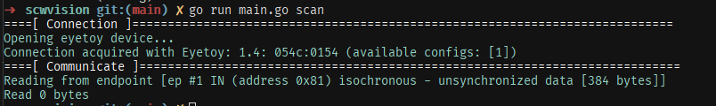

# SCWVision
A tinker tool playing with the Sony Eyetoy



# Sony EyeToy
The Sony EyeToy was a webcam device developed for use with the PlayStation2. Interestingly, it used generic hardware and is supported by the OV519 driver set.

I suspect it is likely to be USB1.1 in spec.

### What we know

The Sony EyeToy Vendor and Product IDs are defined as 

```go
const SonyEyeToyVendorID uint16 = 1356 // 0x054c Sony Corp.
const SonyEyeToyProductID uint16 = 340 // 0x0154 Eyetoy Audio Device
```

Although on some platforms, such as Windows11 the human readable VendorID is "Logitech" for some reason despite 0x054c definitely being a Sony namespace with many devices.

The Sony EyeToy appears to present a single configuration, with index `1`, and this configuration has 5 interfaces defined by configuration alternates.

| Configuration | Interface | Alternate | Endpoint | Packet Size |
|---------------|-----------|-----------|----------|-------------|
| 1             | 0         | 0         | 0x81 1:IN| 0 bytes     |
| 1             | 0         | 1         | 0x81 1:IN| 384 bytes   |
| 1             | 0         | 2         | 0x81 1:IN| 512 bytes   |
| 1             | 0         | 3         | 0x81 1:IN| 768 bytes   |
| 1             | 0         | 4         | 0x81 1:IN| 896 bytes   |

Performing a buffered read on `alternate:0:IN` will always fail with a `packet size too large` error (since it's 0)

However performing buffered reads on the other 4 endpoints will actually perform a roundtrip transaction

```
[ 0.133531] [0002fea7] libusb: debug [libusb_handle_events_timeout_completed] doing our own event handling
[ 0.133572] [0002fea6] libusb: debug [libusb_submit_transfer] transfer 0x7faab4001100
[ 0.133587] [0002fea6] libusb: debug [submit_iso_transfer] need 1 urbs for new transfer with length 3840
[ 0.133580] [0002fea7] libusb: debug [usbi_wait_for_events] poll() 3 fds with timeout in 100ms
[ 0.145376] [0002fea7] libusb: debug [usbi_wait_for_events] poll() returned 1
[ 0.145418] [0002fea7] libusb: debug [reap_for_handle] urb type=0 status=0 transferred=0
[ 0.145422] [0002fea7] libusb: debug [handle_iso_completion] handling completion status 0 of iso urb 1/1
[ 0.145424] [0002fea7] libusb: debug [handle_iso_completion] all URBs in transfer reaped --> complete!
[ 0.145428] [0002fea7] libusb: debug [usbi_handle_transfer_completion] transfer 0x7faab4001100 has callback 0x6eac30
[ 0.145624] [0002fea8] libusb: debug [libusb_free_transfer] transfer 0x7faab4001100
```

However there is No Data transmitted. I suspect this is because the Eyetoy requires a control request sent to begin sending data, however I have not discovered this as of yet.

# Development
There are a few things that need done to tinker against USB devices depending on the context.

### Linux

In order to more easily develop against USB devices, you can enable permissions on linux.

/etc/udev/rules.d/10-eyetoy.rules
```
SUBSYSTEM=="usb", ATTR{idVendor}=="0x054c", ATTR{idProduct}=="0x0154", MODE="0660", GROUP="plugdev"
```

then

```
sudo udevadm control --reload-rules
```

Then plug the device in (if it was plugged in already, plug-cycle it). If WSL disconnect, reconnect, then re-attach to WSL.

### Linux on WSL

This has been tested to work on WSL, however you need to bind and then attach the USB device from windows.

```powershell
PS C:\WINDOWS\system32> usbipd list
Connected:
BUSID  VID:PID    DEVICE                                                        STATE
1-3    0489:e0c8  MediaTek Bluetooth Adapter                                    Not shared
1-4    0c45:6a10  Integrated Webcam                                             Not shared
2-2    054c:0154  Logitech EyeToy USB Camera                                    Not Shared
2-3    187c:0550  USB Input Device                                              Not shared
3-1    0d62:cabc  USB Input Device                                              Not shared

PS C:\WINDOWS\system32> usbipd bind --busid 2-2
PS C:\WINDOWS\system32> usbipd attach --wsl --busid 2-2
```

usbipd bind makes the device sharable, attach mounts it into the WSL instance.

Note: This requires an up to date usbipd.